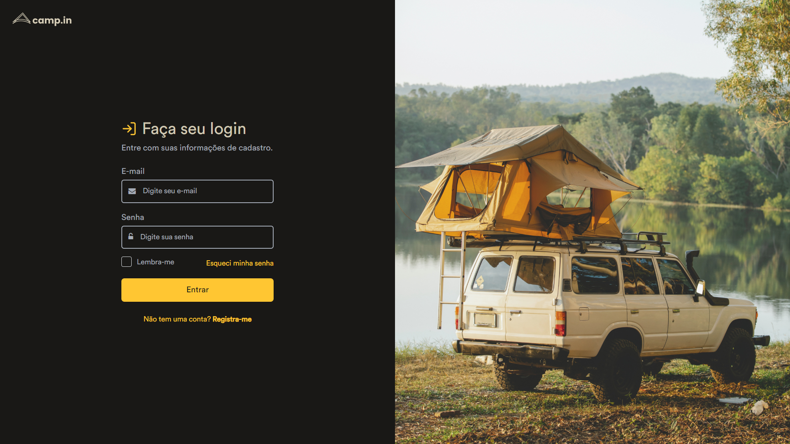

### Página de Login em HTML5, CSS3 e Bootstrap
#### _Este projeto é uma página de login desenvolvida em HTML5, CSS3 e Bootstrap  é um modelo de login minimalista, intuitivo, original e responsivo e de código aberto._

### Download
##### _faça o download clicando em Code > Download_
##### _Se preferir, clone o repositorio atraves do git_

### Pré-requisitos
##### _navegador com suporte a HTML5 e CSS3_
##### _navegadores suportados (testados): Brave, Chrome, Edge, Firefox e Opera(GX)_
### Tutorial
##### _Baixe o arquivo e edite na sua IDE preferida_

### Tecnologias Usadas
##### _HTML5_
##### _CSS3_
##### _Bootstrap_

### Autor
##### Daniel Filipe